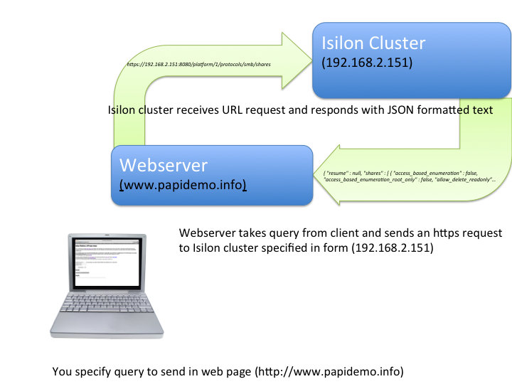

# Isilon Platform API (PAPI) basic demo

This is a basic demo, intended as an educational tool, to demonstrate how Isilon's restful API works.

Those familiar with Google's RESTful APIs, other storage products such as EMC Unity & XtremIO will not really need to use this demo.

For students/partners/customers unfamiliar with web APIs and those curios as to how Isilon's platform API works this demo is intended to be as 
simple as possible and does not represent the more advanced functions that are possible.

To see the live demo running see [papidemo.info](http://www.papidemo.info)

From description.html:

## Description

This demo is using the Platform API for Isilon (sometimes referred to as PAPI).
The Platform API allows you to query and even send commands to an Isilon cluster. 
The commands are sent in a [RESTful](http://en.wikipedia.org/wiki/Representational_state_transfer) fashion.
This essentially means that the information is being accessed as if the application were accessing a web page from a webserver (the Isilon cluster being that webserver).

To access we do need to provide a username and password (so that it is secure) although note that in this demo application the username and password given are not well protected (it is a simple test).

The information sent back is in a format called [JSON](http://en.wikipedia.org/wiki/JSON) which is a method for encoding an array, which can be decoded 
and then used in a program (in this case PHP).

The demo uses PHP and JQUERY (PHP doing the work, [JQUERY](http://en.wikipedia.org/wiki/JQuery) making it act in a nice interactive manner).
